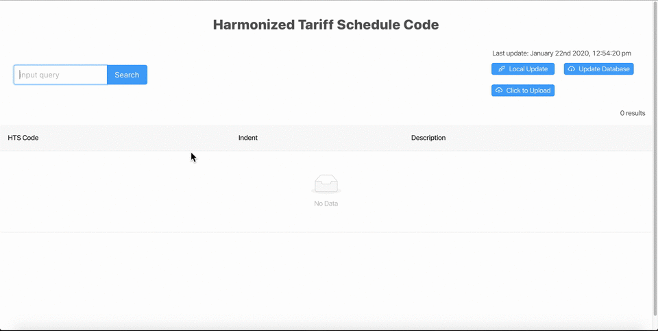
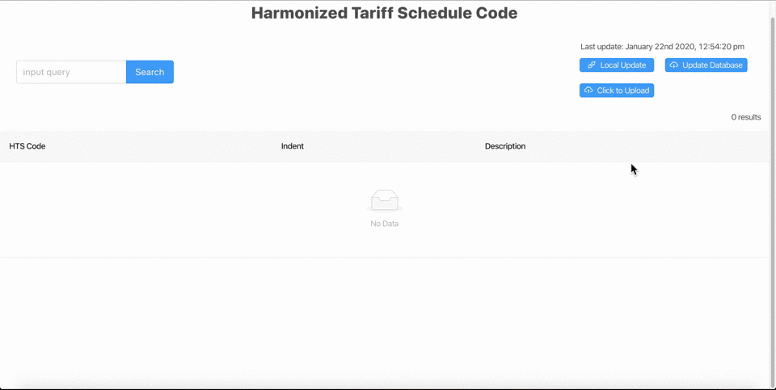

# Better Query for Harmonized Tariff Schedule (Backend - Repo)

### Aim 
Improve HTS code search to retrieve its associated descriptions and details.

### Goals
1. Make HTS Code backend API, to search for item description given keywords, or hts code.
2. Create a better user experience by improving upon the display of the data via its parent-child relationship.  
3. Allow API calls to update the backend with latest HTS tariffs updates manually (Upload) or automatically (Web Automation,scrapping)  
### Strategy  
1. Develop using MERN Stack
> + MongoDb
> + Express Framework
> + React
> + NodeJS
2. Data retrieval
> + NightmareJS (headless browsing automation) to retrieve latest HTS_Code csv file  
3. Data enhancement using Python libraries
> + Converting lengthly description into keywords for search
> + Removal of stopwords from keywords
> + NLTK for lemmatizer
> + Textblob to add plural and singular
> + Adding Parent Child Relationship for the data based on indentation
> + Ancestry details to better display on ant design
4. MongoDB  
> + Saving the modified data onto Mongo Database
5. Backend
> + NodeJS to handle HTTP request from react frontend
6. Frontend
> + Search box to search for item keywords
>> + Search via keywords
>> + Search via Hts code (Using Regex)
> + Display the details on react frontend with a Ant design nested table  

### API Endpoints
1. Search
> * /Search - Search By keyword, can take multiple keywords, separated by spaces 
> * /Searchc - Search By HTS_Code, done with regex, its catches anything that matches the hts code   
2. Update
> * /getLatest - Web scrapes for latest, data/keyword enhancement, before saving to the database.
> * /getLocal - User uploads hts_code.csv file, data/keyword enhancement, before saving to the database  
> * /getLastUpdate - Returns the timestamp for the last online update  

### Data enhancement - focus.py
> * Ran as a child-process whenever update api is called for by the client side.
> * Socket.io used to capture the completion of child process via event-based communication. 
> * Returns modified.csv with the following changes
>> 1. Added Keyword column - Description column split, removal of stop words, add plurals/singulars and lemmatization.
>> 2. Added parentChildRelation to *child* column - Child will have its parent's row here, this is for improving time complexity on data retrieval at the expense of space complexity. Done using Dyanamic Programming Algorithm
>> 3. Added Parent Column - Contains the source parent of an item, source parents have indent of zero
>> 4. Added Ancestry Column - Contains a list of all it's parents' key that has lower indent than itself  
>> 5. Added key Column - Contains a unique identifier for each row, this is same as row index, for ant design table 
> * Pandas library used here to convert nested arrays to .csv file on output  

## Built With
### Javascript
* [nightmareJS](http://www.nightmarejs.org/) - Nightmare is a high-level browser automation library.
* [mongooseJS](https://mongoosejs.com/) - Mongoose provides a straight-forward, schema-based solution to model your application data. It includes built-in type casting, validation, query building, business logic hooks and more, out of the box.
* [expressJS](https://expressjs.com/) - Express is a minimal and flexible Node.js web application framework that provides a robust set of features for web and mobile applications.
* [Axios](https://www.npmjs.com/package/axios)  - Promise based HTTP client for the browser and node.js
* [lodash](https://lodash.com/) - A modern JavaScript utility library delivering modularity, performance & extras.
* [socket.io](https://www.npmjs.com/package/socket.io) - Socket.IO enables real-time bidirectional event-based communication.
* [Babel7](https://babeljs.io/) - Babel is a toolchain that is mainly used to convert ECMAScript 2015+ code into a backwards compatible version of JavaScript in current and older browsers or environments.
### Python3
* [Textblob](https://textblob.readthedocs.io/en/dev/) - TextBlob is a Python (2 and 3) library for processing textual data.
* [NLTK](https://www.nltk.org/) - NLTK is a leading platform for building Python programs to work with human language data.
* [Pandas](https://pandas.pydata.org/) - pandas is an open source, BSD-licensed library providing high-performance, easy-to-use data structures and data analysis tools for the Python programming language. 
### ReactJS
* [Ant Design](https://ant.design/components/table/#components-table-demo-nested-table) - A design system with values of Nature and Determinacy for better user experience of enterprise applications.
## Screen Captures

    
    

Demo - search(left) , updates(right)

 
## Documented by
* Zenger Soong Cun Yuan

